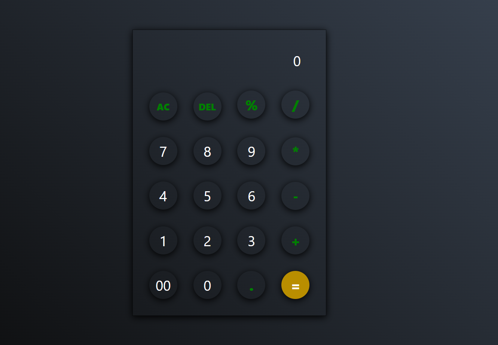

Modern Calculator 🖩
A simple yet beautiful calculator with a modern and minimalistic design inspired by Neumorphism UI.

🚀 Features
✅ Sleek and minimal design
✅ Supports basic arithmetic operations (+, -, *, /, %)
✅ AC and DEL buttons for input management
✅ = button for calculating results

🛠️ Technologies Used
HTML, CSS, JavaScript
Neumorphism Design for a better user experience
📸 Preview
(

📂 Installation & Usage
bash
Copy
Edit
git clone https://github.com/your_username/your_repository.git
cd your_repository
open index.html
🔗 Live Demo
[https://kamranshakib.github.io/Calculator-/]

